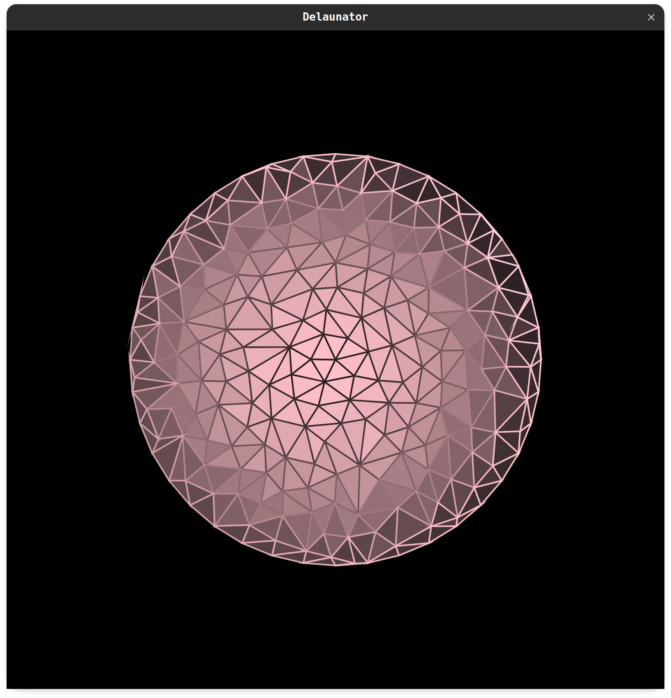

## Delaunator

A Kotlin port of Mapbox's [Delaunator](https://github.com/mapbox/delaunator) incredibly fast JavaScript library for Delaunay triangulation of 2D points. 

## Installation

```graddle
repositories {
    maven { jcenter() }
    // or
    maven { url "https://jitpack.io" }
}

dependencies {
    compile "com.github.ricardomatias:delaunator:1.0.2"
}
```

## Usage

```kotlin
    val points = doubleArrayOf(5.0, 2.0, 3.0, 4.0..) // (x0, y0, x1, x1, x2, y2)
    val delaunator = Delaunator(points)
    val triangles = delaunator.triangles
    val hull = delaunator.hull

    for (i in triangles.indices step 3 ) {
        val t0 = triangles[i] * 2
        val t1 = triangles[i + 1] * 2
        val t2 = triangles[i + 2] * 2
    
        // clockwise point orientation
        val p1 = doubleArrayOf(points[t0], points[t0 + 1])
        val p2 = doubleArrayOf(points[t1], points[t1 + 1])
        val p3 = doubleArrayOf(points[t2], points[t2 + 1])
    }

    for (h in hull) {
        val p1 = doubleArrayOf(points[2 * h], points[2 * h + 1])
    }

    // Updates the triangulation after the points have been modified in-place.
    delaunator.update()
```

## Example

You can try the following example with [OPENRNDR](https://github.com/openrndr/openrndr), source code can be found [here](https://github.com/openrndr/orx/blob/master/orx-triangulation/src/demo/kotlin/DemoDelaunay01.kt).


